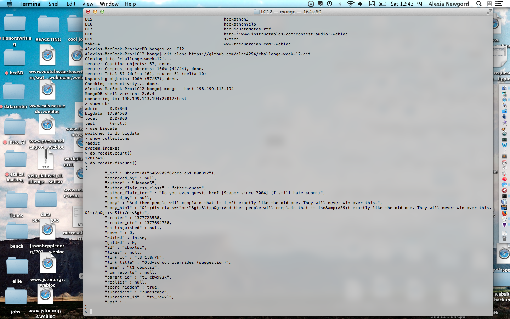
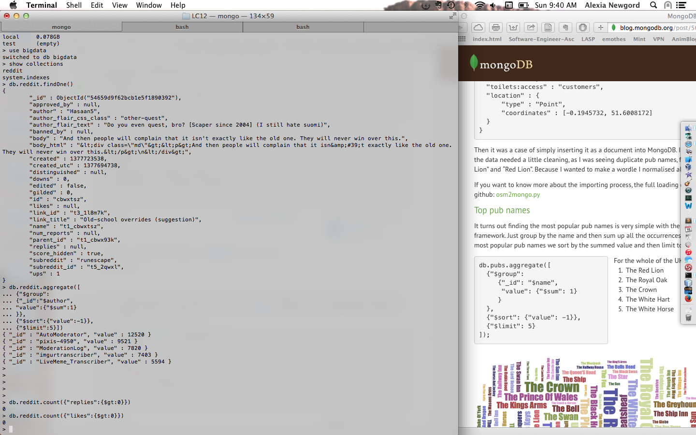
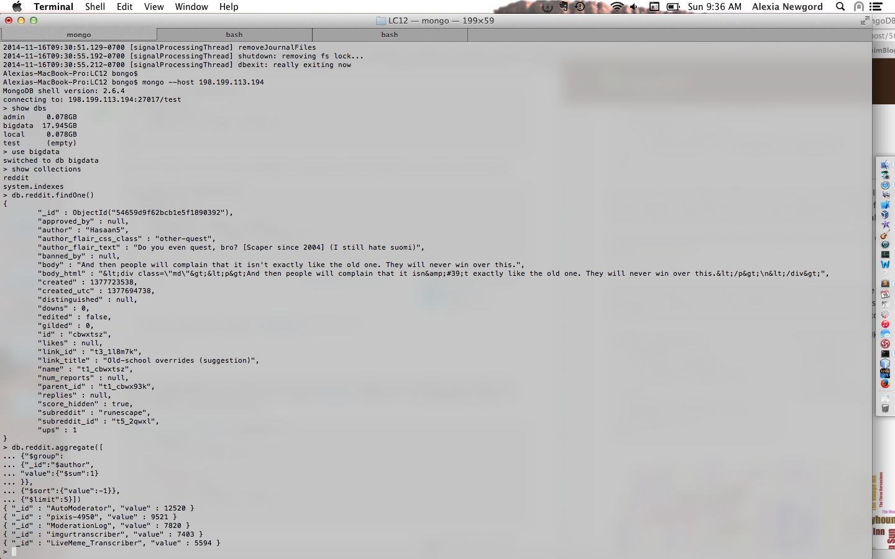
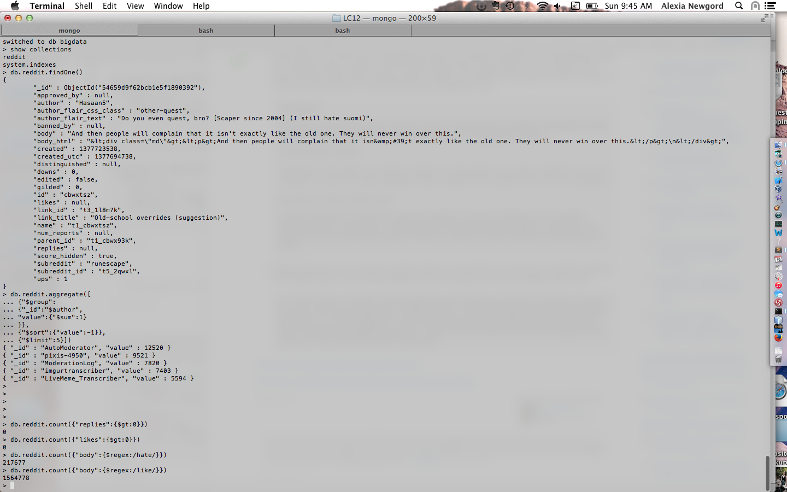
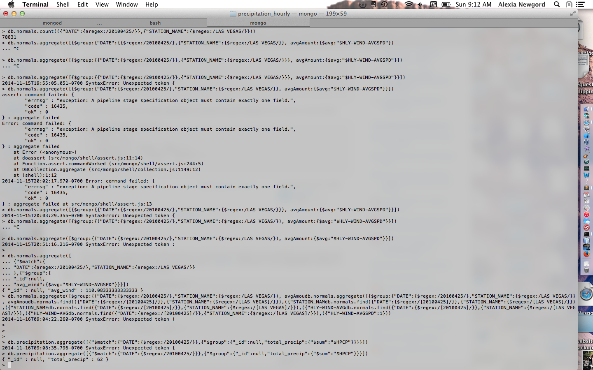
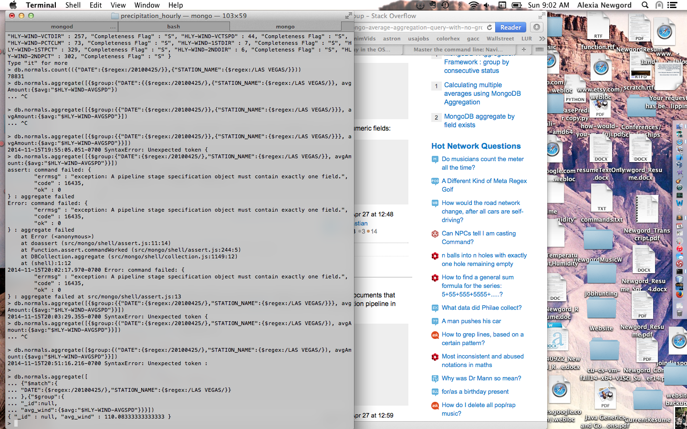
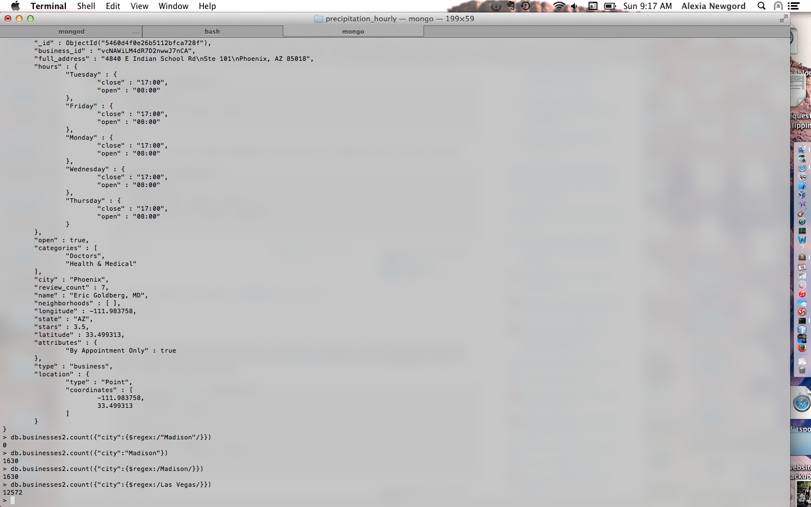
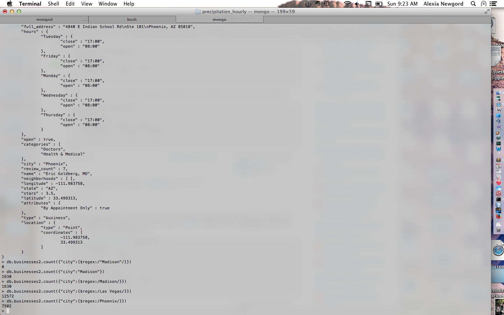

# Challenge Week 12 Submission Template

# Reddit Data Challenges

## Challenge 1

## Challenge 2

All of the documents have a 'like' and 'replies' value of null.

## Challenge 3

The only measure for popularity will be sub-reddits, but we can still identify general patterns by the author.  Perhaps we can look at the most popular authors... The five most frequent authors were:
"AutoModerator", "value" : 12520
"pixis-4950", "value" : 9521
"ModerationLog", "value" : 7820
"imgurtranscriber", "value" : 7403
"LiveMeme_Transcriber", "value" : 5594

## Challenge 4

If we could look at common words, it could give us some indications about the population that uses it.
For example, we notice that 217,677 documents contain the word "hate" while 1,564,778 documents conatin the word "like".  That can help suggest the sentiment of the site, while other keywords can indicate what the content of the posts are typically about.

## Challenge 5

No commenter info in data set? 

## Challenge 6

Since the data is only a subset of reality, we need to adjust our conclusions.  Perhaps it is actually more representative of the Reddit population, since only the comments that were approved by the populace were included.  However, we will not notice certain niches that may be equally important, even if not "liked".

## Challenge 7

Are conclusions would only apply to this subset.  We would need to do further analysis what an upvote means before adjusting them.

## Challenge 8

Limitations in data... we only have so much time in the data set.  Perhaps it is restricted to a geographic region or occurred during some sort of special day which could have affected the behavior.

## Challenge 9

Look at world events surrounding this date or evaluate the quantitative limitations of the data set.

## Challenge 10

On Aug. 28, 2013, the day of this data, there were breaking news about conflict in Syria and a cyberattack on the New York Times website.  These stories (especially the latter) could certainly change the "normal" behavior on Reddit.

# Yelp and Weather 

## Challenge 1

Answer: 62

## Challenge 2

Answer: 110.083333

## Challenge 3

Answer: 1630

## Challenge 4

Answer: 12572

## Challenge 5

Answer: 7502

## Challenge 6

?????

## Challenge 7 [BONUS]

[Code]
[Answer]

